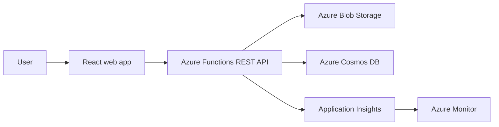

# AzureVista

AzureVista is a cloud-native multimedia library developed as an Ulster University project. It lets users upload, browse and delete image, video and audio files through a React interface backed by serverless Azure services.

This repository is an independent portfolio rebuild based on the confirmed project scope. A recovered local prototype depended on an unlicensed third-party tutorial repository, so that code and its assets are deliberately excluded.

## Architecture



The browser never receives an Azure storage key or a long-lived SAS token. The Function App accesses Blob Storage and Cosmos DB through its managed identity.

## Features

- Upload image, video and audio files
- List stored media and metadata
- Stream media through the API
- Delete media and its metadata record
- Validate file type and upload size on the server
- Record operational logs for Application Insights
- Run locally with Azurite and the Cosmos DB emulator or authorised Azure resources

## Repository structure

```text
frontend/       React and Vite user interface
api/            Azure Functions v4 API
docs/           Architecture, deployment, security and testing notes
```

## Local setup

### 1. API

```text
cd api
copy local.settings.json.example local.settings.json
npm install
npm start
```

Replace the placeholder values in `local.settings.json` with local emulator settings or authorised development resources. Never commit that file.

### 2. Frontend

```text
cd frontend
copy .env.example .env.local
npm install
npm run dev
```

The default frontend configuration expects the API at `http://localhost:7071/api`.

## API routes

| Method | Route | Purpose |
|---|---|---|
| `GET` | `/api/media` | List media metadata |
| `POST` | `/api/media` | Upload one multipart file |
| `GET` | `/api/media/{id}/content` | Stream stored media |
| `DELETE` | `/api/media/{id}` | Delete a media item |
| `GET` | `/api/health` | Check API availability |

## Azure services

| Service | Responsibility |
|---|---|
| Azure Functions | Serverless REST API and validation |
| Azure Blob Storage | Binary media objects |
| Azure Cosmos DB | Media metadata |
| Managed Identity | Keyless service-to-service authentication |
| Application Insights | Request, error and dependency telemetry |
| Azure Monitor | Operational dashboards and alerts |

## Security notes

- The API uses `DefaultAzureCredential` and does not accept storage credentials from the browser.
- Production deployment must enable Microsoft Entra authentication or another approved identity layer before public use.
- Blob containers should remain private.
- Uploads are restricted by media type and size, but production systems should also scan content for malware.
- Resource names, subscription IDs, account keys and live endpoints are excluded from the repository.

See [Security](docs/security.md) and [Deployment](docs/deployment.md) for the complete checklist.

## Project status

The independent source rebuild and documentation are published. It has been checked locally at source and unit-test level, but it has not been deployed from this repository because no live Azure subscription or resource identifiers were supplied.

## Responsible use

This is an educational portfolio project. Before production use, add user authentication, authorisation, malware scanning, retention rules, rate limiting and an accessibility review.

## Technical references

- [Azure Functions Node.js developer guide](https://learn.microsoft.com/azure/azure-functions/functions-reference-node)
- [Azure Blob Storage JavaScript quickstart](https://learn.microsoft.com/azure/storage/blobs/storage-quickstart-blobs-nodejs)
- [Azure Cosmos DB JavaScript guide](https://learn.microsoft.com/azure/cosmos-db/how-to-javascript-get-started)
- [Azure Functions monitoring](https://learn.microsoft.com/azure/azure-functions/configure-monitoring)

## Author

Kashika Sharma  
BSc (Hons) Computing Systems, Ulster University London
