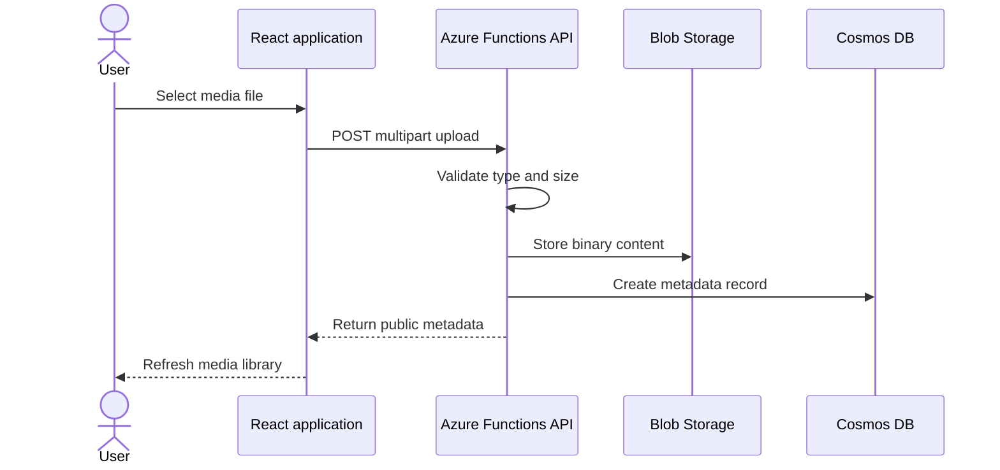

# Architecture

AzureVista separates the public user interface from access to Azure data services. The React application calls an Azure Functions API. The API validates requests and uses its managed identity to access private Blob Storage and Cosmos DB resources.

## Design decisions

| Decision | Reason |
|---|---|
| Private Blob container | Prevents anonymous access to uploaded objects |
| Managed identity | Removes storage and database credentials from application code |
| API-mediated download | Keeps Blob Storage private and avoids long-lived browser tokens |
| Cosmos metadata record | Supports filtering and future enrichment without inspecting binary objects |
| Opaque blob names | Avoids collisions and prevents user filenames becoming storage paths |
| Compensating delete after failed metadata write | Reduces orphaned blobs when an upload partly fails |

## Trade-offs

API-mediated downloads are straightforward and secure for an educational project, but they use Function App bandwidth. A production system serving large media should issue short-lived user-delegation SAS URLs after authorisation or use a content delivery layer.

